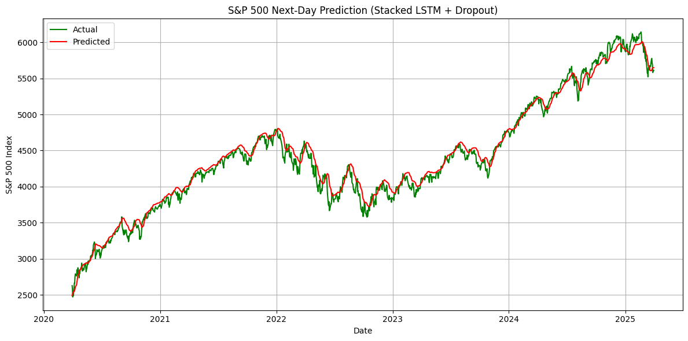

# S&P 500 Index Forecasting

To forecast the S&P 500 Index, I applied both classical **time series analysis** using the ARIMA model and deep learning techniques with **Recurrent Neural Networks (RNN)**, including stacked **LSTM** architectures. The dataset includes daily S&P 500 closing prices from January 2000 to April 1, 2025. These models were evaluated and compared based on their predictive performance and ability to capture underlying market trends.

## Part 1: Time Series Analysis

In the first part of the project, I adopted a **classical time series analysis framework** to develop the ARIMA model step by step.

### Step 1: Data Pre-processing

There are **6,349 daily records** of S&P 500 index data spanning from January 2000 to April 1, 2025. For modeling purposes, I used data up to **April 1, 2020** for training and reserved the final five year for testing. 

Since **stationarity**—a condition where the mean and variance remain constant over time—is a key requirement for ARIMA modeling, and daily stock data tends to be noisy and non-stationary, I resampled the series to **monthly averages** to smooth fluctuations and enable more robust forecasting.

To assess stationarity, I applied the **Augmented Dickey-Fuller (ADF) test**. After performing **first-order differencing** on the monthly training data, the ADF test returned a **p-value below 0.05**, indicating that the differenced series is stationary and suitable for ARIMA modeling. The time series plot of the differenced data is shown below.

### Step 2: ARIMA Model Fitting

To identify the optimal order $(p, d, q)$ for the ARIMA model, I first fixed the differencing parameter $d=1$, as determined from the previous stationarity analysis. To determine the appropriate values for the autoregressive ($p$) and moving average ($q$) terms, I conducted a **grid search** over a range of combinations and selected the model with the **lowest Akaike Information Criterion (AIC)**.

The best-performing model was **ARIMA(4, 1, 5)**, with an **AIC of 2705.9**.

To validate the model, I performed diagnostic checks on the **residuals**. The residual errors appear to:

- Fluctuate randomly around a mean of zero,
- Follow an approximately normal distribution,
- And exhibit no significant autocorrelation.

These diagnostic results indicate that the ARIMA(4, 1, 5) model is well-specified and suitable for forecasting.

### Step 3: Monthly Forecasting

Leveraging the **ARIMA(4, 1, 5)** model, I forecasted the next **60 monthly values** of the S&P 500 Index, starting from **April 2020**. To improve forecast reliability, I employed a **rolling forecast strategy** with a **95% confidence interval**, where the model predicts **one step ahead at a time**. After each prediction, the actual observed value was incorporated into the training data to inform the next forecast.

The resulting predicted values, along with their confidence intervals, are compared against the actual test data in the following visualization:

The resulting **Mean Absolute Error (MAE)** is **120.88**, and the **Root Mean Squared Error (RMSE)** is **152.16**.

- The **MAE** indicates that, on average, the forecasted monthly S&P 500 values deviate from the actual values by about **121 index points**.
- The **RMSE**, which penalizes larger errors more heavily, suggests that the typical prediction error is around **152 points**.

## Part 2: Recurrent Neural Networks

In the second part of the project, I explored a **deep learning approach** by developing a **Recurrent Neural Network (RNN)** model based on the **Long Short-Term Memory (LSTM)** architecture, which is well-suited for sequence prediction tasks.

### Step 1: Data Pre-processing

Since deep learning models typically require large-scale datasets, I chose to build the LSTM model using **daily records** instead of monthly averages to better leverage the data's granularity. The input data was properly normalized using Min-Max scaling, and I constructed input sequences such that the model uses the **previous 60 days** of data to predict the **next day’s closing value**.

Consistent with the setup in Part 1, I used data up to **April 1, 2020** for training and reserved the **final five years** for testing, allowing for a fair comparison between the ARIMA and LSTM models.

### Step 2: RNN Model Fitting

The RNN model I implemented consists of **two stacked LSTM layers**, each followed by **dropout layers** to reduce overfitting and improve generalization. I chose **LSTM (Long Short-Term Memory)** over Simple RNN (SRN) due to its enhanced ability to capture **long-term dependencies** and mitigate the **vanishing gradient problem**, which is common in traditional RNNs when dealing with longer sequences like financial time series.
The final model contains a total of **149,957 parameters**, of which **49,985 are trainable**, allowing it to learn complex temporal patterns while maintaining a manageable level of complexity.

After proper hyperparameter tuning, the following configuration yielded the **best reduction in training and validation Mean Squared Error (MSE)** across all experimental runs:

- LSTM units: 64
- Dropout rate: 0.4
- Optimizer: Adam
- Epochs: 10
- Batch size: 32

The resulting **training and validation loss** (MSE) over the training epochs are shown below. The **training loss consistently decreases**, while the **validation loss begins to improve significantly after the 6th epoch**, indicating that the model starts to generalize better at that point.

### Step 3: Daily Forecasting

The resulting predicted values are compared against the actual test data in the following visualization:

The forecasted values from the LSTM model closely follow the actual test data, demonstrating that **deep learning methods provide significantly improved performance** over classical time series models in this case.

On the test set, the LSTM model achieved a **Mean Absolute Error (MAE)** of **75.97** and a **Root Mean Squared Error (RMSE)** of **99.48**, indicating that, on average, the predictions deviate from the true values by approximately **76 points**, with typical errors not exceeding **100 points**.

In comparison, the ARIMA model resulted in a higher **MAE of 120.88** and **RMSE of 152.16**, suggesting that the LSTM model captured the underlying patterns in the index movements more effectively and produced more accurate forecasts.
